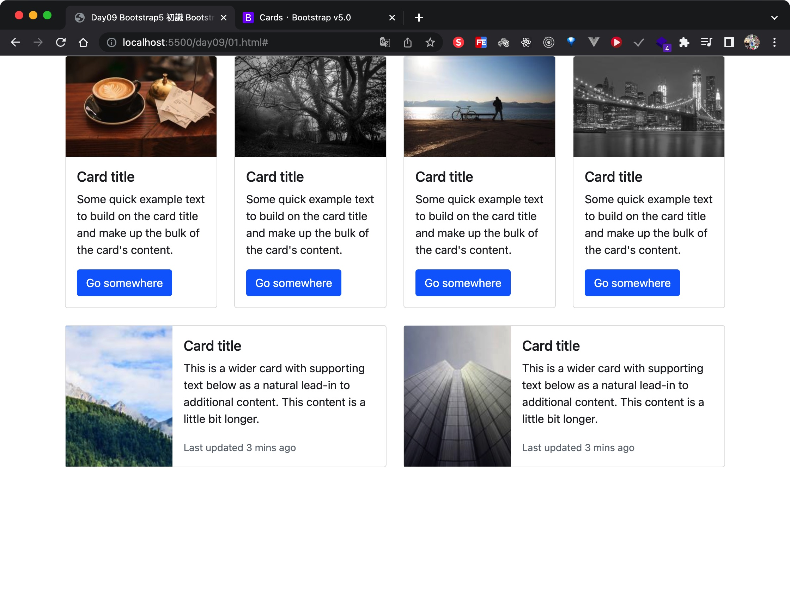
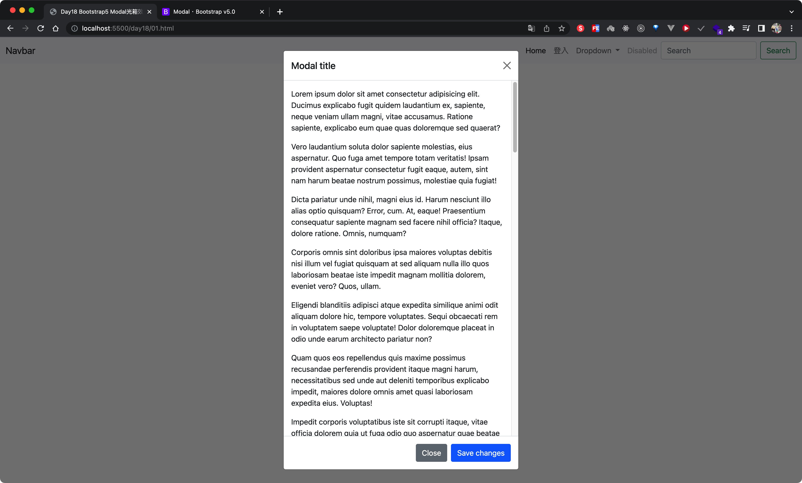

# 金魚都能懂的Bootstrap5

實作練習筆記，也方便之後參考

# 官網

使用5.0.x版本練習

https://getbootstrap.com/

# 線上DEMO

https://ivesshe.github.io/Bootstrap5_GoldFish/

# Day02 Bootstrap5 安裝與快速檢測方式

[Day02](./day02/02.html)

# Day03 Bootstrap5 格線系統入門

[Day03 01](./day03/01.html)

[Day03 02 item上作調整](./day03/02.html)

[Day03 03 row上作調整](./day03/03.html)

# Day04 Bootstrap5格線的對齊與分佈

[Day04 01](./day04/01.html)

# Day05 Bootstrap5 格線排序控制

[Day05 01](./day05/01.html)

# Day06 Bootstrap5 格線距離控制

[Day06 01](./day06/01.html)

[Day06 02 交錯排版](./day06/02.html)

# Day07 Bootstrap5 圖片與寬高尺寸控制

[Day07 01](./day07/01.html)

[Day07 02](./day07/02.html)

[Day07 03](./day07/03.html)

# Day08 Bootstrap5 共用項目margin與padding

[Day08 01](./day08/01.html)

# Day09 Bootstrap5 初識 Bootstrap5 卡片組件

[Day09 01](./day09/01.html)

# Day10 Bootstrap5 再探 Bootstrap5 卡片組件

[Day10 01](./day10/01.html)

[Day10 02](./day10/02.html)

[Day10 03](./day10/03.html)

# Day11 Bootstrap5 清單群組快速入門

[Day11 01](./day11/01.html)

[Day11 02](./day11/02.html)

# Day12 Bootstrap5 RWD選單秒完成

[Day12 01](./day12/01.html)

# Day13 Bootstrap5 麵包屑與路徑列

[Day13 01](./day13/01.html)

# Day14 Bootstrap5 分頁導覽輕鬆做

[Day14 01](./day14/01.html)

[Day14 02](./day14/02.html)

# Day15 Bootstrap5 Display之顯示/隱藏/屬性控制

[Day15 01](./day15/01.html)

# Day16 Bootstrap5 Flex控制太簡單

[Day16 01](./day16/01.html)

# Day17 Bootstrap5 幻燈片製作無困難

[Day17 01](./day17/01.html)

# Day18 Bootstrap5 Modal光箱效果太Easy

[Day18 01](./day18/01.html)

# Day19 Bootstrap5 Tooltip與Popover提示訊息

[Day19 01](./day19/01.html)

# Day20 Bootstrap5 Collapse收合區塊

[Day20 01](./day20/01.html)

# Day21 Bootstrap5 共用項目color知多少

[Day21 01](./day21/01.html)

# Day22 Bootstrap5 共用項目overflow

[Day22 01](./day22/01.html)

# Day23 Bootstrap5 共用項目border

[Day23 01](./day23/01.html)

# Day24 Bootstrap5 按鈕組件

[Day24 01](./day24/01.html)

# Day25 Bootstrap5 按鈕組件

[Day25 01](./day25/01.html)

# 參考資料

https://getbootstrap.com/docs/5.0/getting-started/introduction/

https://www.youtube.com/watch?v=YX6KZIcUeY8&list=PLqivELodHt3jq3oWBZfdhMu0GE7774HBW&ab_channel=CSScoke

https://ithelp.ithome.com.tw/users/20112550/ironman/3796