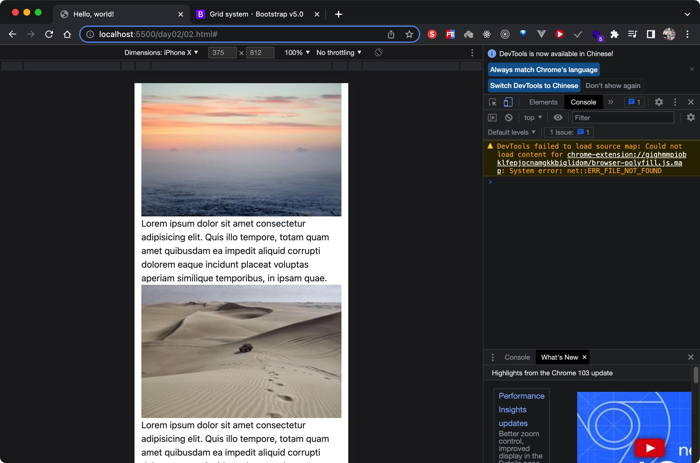

# 金魚都能懂的Bootstrap5

實作練習筆記，也方便之後參考

# 官網

使用5.0.x版本練習

https://getbootstrap.com/

# 線上DEMO

https://ivesshe.github.io/Bootstrap5_GoldFish/

# Day02 Bootstrap5 安裝與快速檢測方式

[Day02](./day02/02.html)

# Day03 Bootstrap5 格線系統入門

[Day03 01](./day03/01.html)

[Day03 02 item上作調整](./day03/02.html)

[Day03 03 row上作調整](./day03/03.html)

# Day04 Bootstrap5格線的對齊與分佈

[Day04 01](./day04/01.html)

# Day05 Bootstrap5 格線排序控制

[Day05 01](./day05/01.html)

# Day06 Bootstrap5 格線距離控制

[Day06 01](./day06/01.html)

[Day06 02 交錯排版](./day06/02.html)

# Day07 Bootstrap5 圖片與寬高尺寸控制

[Day07 01](./day07/01.html)

[Day07 02](./day07/02.html)

[Day07 03](./day07/03.html)

# Day08 Bootstrap5 共用項目margin與padding

[Day08 01](./day08/01.html)

# Day09 Bootstrap5 初識 Bootstrap5 卡片組件

[Day09 01](./day09/01.html)

# 參考資料

https://getbootstrap.com/docs/5.0/getting-started/introduction/

https://www.youtube.com/watch?v=YX6KZIcUeY8&list=PLqivELodHt3jq3oWBZfdhMu0GE7774HBW&ab_channel=CSScoke

https://ithelp.ithome.com.tw/users/20112550/ironman/3796